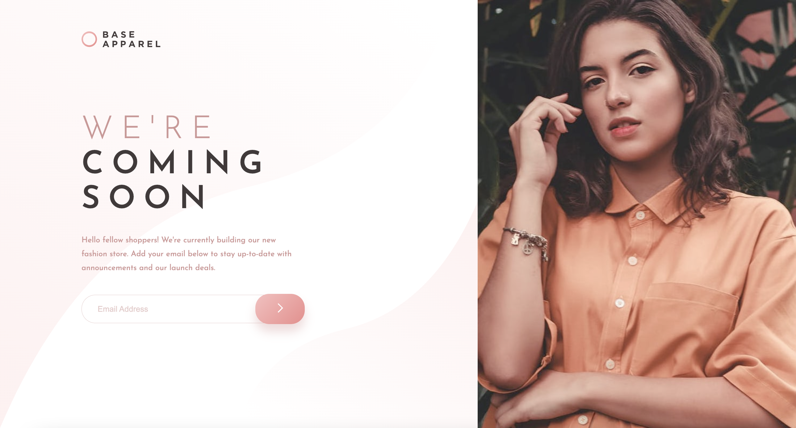

# Base Apparel coming soon page solution

This is a solution to the [Base Apparel coming soon page challenge on Frontend Mentor](https://www.frontendmentor.io/challenges/base-apparel-coming-soon-page-5d46b47f8db8a7063f9331a0).

## Table of contents

- [Overview](#overview)
  - [The challenge](#the-challenge)
  - [Screenshot](#screenshot)
  - [Links](#links)
- [My process](#my-process)
  - [Built with](#built-with)
  - [What I learned](#what-i-learned)
  - [Continued development](#continued-development)
  - [Useful resources](#useful-resources)
- [Author](#author)

## Overview

### The challenge

Users should be able to:

- View the optimal layout for the site depending on their device's screen size
- See hover states for all interactive elements on the page
- Receive an error message when the `form` is submitted if:
  - The `input` field is empty
  - The email address is not formatted correctly

### Screenshot



### Links

- [Solution on frontendmentor.io](https://www.frontendmentor.io/solutions/base-apparel-coming-soon-page-vvgqzKrgaJ)
- [Live preview](https://piwkoo.github.io/base-apparel-coming-soon-page/)

## My process

### Built with

- Semantic HTML5 markup
- CSS custom properties
- CSS Grid
- Mobile-first workflow
- BEM methodology

### What I learned

During this project I had an opportunity to use CSS Grid. When elements are 2-dimensional Grid really shines. I had to give it a thought how should I approach this and style all the components in the best possible way. Also, I used grid-template property so kept code sweet and short.

```css
.container {
  grid-template:
      ". logo hero" 230px
      ". form hero" auto
      ". form hero" auto / minmax(10vw, 165px) 1fr 40vw;
}
```

### Continued development

In future projects I will style more complicated layouts and connect available functionalities like flexbox and grid together to write more clean and optimized code.

### Useful resources

- [Grid template](https://developer.mozilla.org/en-US/docs/Web/CSS/grid-template) - As always Mozilla came handy. It's easy to get confused with grid-template property so, it helped.

## Author

- Github - [@PiwkoO](https://github.com/PiwkoO)
- Frontend Mentor - [@PiwkoO](https://www.frontendmentor.io/profile/PiwkoO)